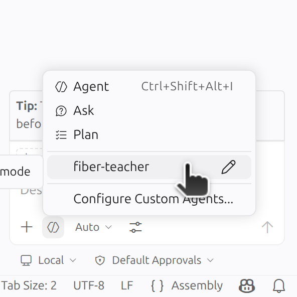

# Repte de vectorització RISC-V: Multiplicació de matrius (gemm)

## 👋 Introducció

Benvingut a aquesta pràctica de laboratori interactiva de l'assignatura [Estructura de Computadors (EC)](https://www.fib.upc.edu/es/grados/grado-en-ingenieria-informatica/plan-de-estudios/asignaturas/EC) de la Facultat d'Informàtica de Barcelona (FIB) a la Universitat Politècnica de Catalunya (UPC). En aquesta sessió explorarem com accelerar la multiplicació de dos matrius (en anglès: *general matrix-matrix multiplicacion* - `gemm`) utilitzant l'extensió vectorial RVV de RISC-V. Ho farem amb el suport de la intel·ligència artificial agèntica (GitHub Copilot) i, més concretament, l'agent docent **fiber-teacher** que actuarà com el teu tutor personal.

Aquesta activitat forma part d'un projecte d'innovació docent que busca potenciar la teva autonomia, familiaritzar-te amb eines d'IA i preparar-te per a arquitectures de computadors més avançades que estudiaràs en altres assignatures.

## 🎯 Objectiu de la pràctica i resultats d'aprenentatge

L'objectiu és passar d'una implementació **escalar** (execució instrucció a instrucció de manera seqüencial) a una implementació **vectorial** (execució paral·lela de diverses instruccions). Aprendràs a utilitzar el concepte *vector length agnostic* (VLA), que permet que el mateix codi s'executi amb diferents amplades del vector.

La multiplicació de matrius es pot interpretar com una aplicació successiva de productes escalars entre un primer vector que representa les files d'una matriu $\mathbf{A}$ i un segon que conté les columnes d'una matriu $\mathbf{B}$:

$$
\mathbf{C} = \mathbf{A}\mathbf{B} \iff
c_{ij} = \sum_{k=0}^{n-1} a_{ik} b_{kj} =a_{i0} b_{0j} + a_{i1} b_{1j} + \ldots + a_{i,n-1} b_{n-1,j}.
$$

La imatge següent compara el recorregut seqüencial d'un vector (esquerra) contra el recorregut vectorial (dreta) de dos elements alhora, cicle a cicle. Fixa't que el vectorial acaba en la **meitat** de temps:


El teu objectiu és:

1. Analitzar el codi escalar de referència i resoldre dubtes relacionades.
2. Identificar quin dels tres bucles ($i, j, k$) és el candidat més *senzill* per vectoritzar.
3. Implementar una solució vectorial que aprofiti la naturalesa **VLA (vector length agnostic)** de RISC-V per obtenir un speedup significatiu.

## 📋 Treball previ

Abans de continuar, realitza les següents tasques obligatòries que et permetran familiaritzar-te amb les instruccions vectorials de RISC‑V, la plataforma GitHub, l'eina VS Code i Copilot Chat. La durada estimada són 60 minuts.

### Introducció a RVV

Segueix el tutorial de Krste Asanovic i Roger Espasa. Els enllaços al material són:

* [Transparències del tutorial RVV](https://riscv.org/wp-content/uploads/2024/12/15.20-15.55-18.05.06.VEXT-bcn-v1.pdf)
* [Tutorial de 35 minuts de YouTube sobre l'ISA vectorial de RISC-V](https://www.youtube.com/watch?v=S4fxBZD79gc)

### Introducció a Git i GitHub (Education)

Primerament crea un compte de [GitHub (Education)](https://github.com/education) amb el teu correu electrònic de la UPC (hauràs de verificar que ets estudiant). En segon lloc, et recomano el tutorial sobre Git i GitHub. Els enllaços al material són:

* [Documentació oficial i guia ràpida de GitHub Education](https://docs.github.com/en/education/quickstart)
* [Tutorial a Git i GitHub](https://github.com/estructura-de-computadors/vectoritzacio-riscv-introduction-to-git-and-github-github-starter-course)

### Instal·lació de programari

1. Instal·la [Docker](https://www.docker.com) i [VS Code](https://code.visualstudio.com/) al teu ordinador (hi ha certes incompatibilitats amb Podman i VSCodium, raó perquè es desaconsella instal·lar aquestes alternatives de codi obert).
2. Obre VS Code, instal·la-hi l'extensió [GitHub Copilot Chat](https://marketplace.visualstudio.com/items?itemName=GitHub.copilot-chat) i configura-la amb el teu compte de GitHub.
. Instal·la l'extensió [Dev Containers](https://marketplace.visualstudio.com/items?itemName=ms-vscode-remote.remote-containers).
3. Instal·la l'extensió [General Assembly Highlighter](https://marketplace.visualstudio.com/items?itemName=VicentBaeza.assembly-syntax).

## 📂 Estructura del repositori

El repositori conté els següents fitxers clau:

* **`Makefile`**: Eina per automatitzar la compilació, l'execució i el testeig del codi.
* **`matrix_mult.c`**: El programa principal (`main`) que s'encarrega d'inicialitzar les matrius, cridar les funcions de multiplicació de matrius i mesurar-ne el temps d'execució.
* **`gemm.c`**: Implementació de referència en llenguatge C de l'algoritme de la multiplicació de matrius.
* **`gemm-riscv-scalar.s`**: Codi font en assemblador RISC-V utilitzant instruccions escalars. Es tracta d'una segona solució de referència escrita en assemblador.
* **`gemm_riscv_vector.s`**: Fitxer on has de desenvolupar la solució vectorial utilitzant l'extensió RVV. Conté una estructura bàsica amb TODOs per guiar-te.
* **`AGENTS.md`**: Fitxer de configuració de la IA agèntica. Aquí es defineix el comportament de l'agent fiber-teacher.
* **`EVALUATION.md`**: Informe final que has d'omplir i lliurar al final de la pràctica, incloent-hi l'anàlisi de rendiment i la reflexió sobre l'ús que has fet de la IA.

## 🛠️ Instruccions d'ús

### VS Code

1. Descarrega el repositori al teu ordinador (`git clone https://github.com/estructura-de-computadors/gemm.git`).
2. Obre el repositori amb VS Code (`File -> Open folder...`) i selecciona l'opció: `Yes, I trust the authors`.
3. Fixa't que l'extensió Dev Containers et demanarà *reobrir* el repositori dins d'un contenidor (docker): accepta la invitació.  Si no sortís el missatge, tanca VS Studio i torna'l a obrir.
4. Espera diversos minuts a la descàrrega de la imatge de Docker.  La primera vegada pot trigar diversos minuts, en funció de la connectivitat a Internet.

### Copilot Chat

<div style="text-align:center;">
  
</div>

1. Dins de la finestra xat, a baix de tot, reemplaça l'agent per defecte `Agent` per l'agent docent `fiber-teacher`.
2. Comença una conversa saludant l'agent i dient-li que ets estudiant d'Estructura de Computadors.
3. L'agent s'introduirà i començarà a posar-te preguntes.
4. A continuació, pots comentar-li que et faci un repàs de l'algoritme del producte escalar, analitzant les implementacions escalars en llenguatge C i assemblador de RISC-V.
5. Recorda que l'agent és completament autònom i no necessita intervenció humana. S'aconsella demanar a l'agent anar pas a pas: n'hi ha **6** en aquesta pràctica.
6. Si ho consideres necessari, demana a l'agent que torni a començar o expliqui els passos en més detall.
7. Assegura't de confirmar l'execució de comandes per part de l'agent: `make`, `find`, `pdftotext` ...

### Compilació i execució

Les diferents regles es troben al fitxer `Makefile`. Per compilar un dels binaris (implementació en llenguatge C) associats a la multiplicació de matrius utilitza:

```bash
make matrix_mult_c
```

Per executar el binari generat utilitza:

```bash
make run_matrix_mult_c
```

### Neteja del directori

Per eliminar els binaris utilitza:

```bash
make clean
```

## 🚀 Metodologia de treball

1. **Preparació:** Abans de començar, assegura't d'haver revisat el material previ sobre l'ISA vectorial de RISC-V i el funcionament de l'extensió RVV. Instal·la VS Code seguint les instruccions descrites en aquest document. Finalment, recorda afegir al repositori el PDF de l'especificació RVV 1.0 perquè l'agent pugui treballar correctament.
2. **Posa en marxa el cronòmetre:** Comença a mesurar el temps que dediques a realitzar la pràctica per reportar-lo més endavant.
3. **Configuració de l'agent:** Obre el fitxer `AGENTS.md` per comprendre com està definit el rol de l'agent `fiber-teacher`.
4. **Desenvolupament iteratiu:** Parla amb l'agent per entendre com s'ha d'implementar la vectorització de manera gradual. Pots demanar-li detalls específics sobre com configurar la longitud del vector `VL` amb la instrucció `vsetvli` i com realitzar la reducció final d'un registre vectorial a un d'escalar.
5. **Validació:** Demana a l'agent que compari els resultats entre les versions escalar i vectorial fent servir les comandes disponibles al `Makefile`, el temps mesurats, el speedup final obtingut i el teòric.
6. **Mesurabilitat**: Mesura el budget consumit associat a les interaccions amb l'agent (tokens, requests, etc.), els outputs de la terminal i guarda la transcripció completa del xat amb l'agent. Recorda adjuntar aquesta informació com a part del lliurament.

## 📝 Lliurament

Quan acabis la sessió, atura el cronòmetre, completa els apartats del fitxer `EVALUATION.md` i lliura'l conjuntament amb els següents fitxers:

1. **`prompt.md`**: Transcripció completa del xat amb l'agent.
2. **`terminal.md`**: Outputs del terminal generats per l'agent.
3. **`budget.md`**: Budget consumit durant les interaccions (en tokens, premium requests, etc.).

Es valorarà especialment:

* La millora de rendiment assolida (speedup).
* La qualitat i el pensament crític demostrat en les teves interaccions amb l'agent d'IA.
* La qualitat de les teves respostes a les preguntes generades per l'agent.
* La transparència en identificar quines parts d'aquesta metodologia docent t'han *realment* ajudat a entendre un problema tan complex com és la vectorització de RISC-V en instruccions d'assemblador.

## 📚 Material addicional

Per evitar les al·lucinacions i millorar la transparència de les respostes de l'agent, es recomana afegir el document d'especificació:

* [Especificació de la versió 1.0 de l'extensió RVV](https://github.com/riscvarchive/riscv-v-spec/releases/download/v1.0/riscv-v-spec-1.0.pdf)

## ⚖️ Llicència

Aquest projecte està llicenciat sota la Llicència Pública General GNU versió 3.0 o posterior (GPL-3.0-or-later). Consulteu el fitxer [LICENSE](LICENSE) per a més detalls.

## 📇 Informació de contacte

Dr. Pedro J. Martinez-Ferrer \
Departament d'Arquitectura de Computadors (DAC) \
Universitat Politècnica de Catalunya - BarcelonaTech (UPC) \
Campus Nord, Edif. D6, C. Jordi Girona 1-3, 08034 Barcelona, Spain \
pedro.martinez.ferrer [at] upc [dot] edu
